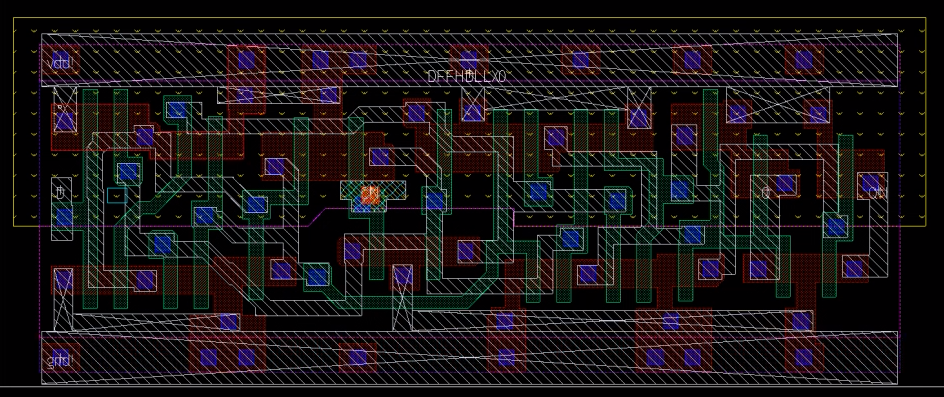
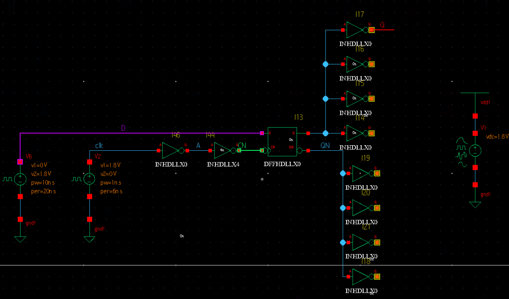
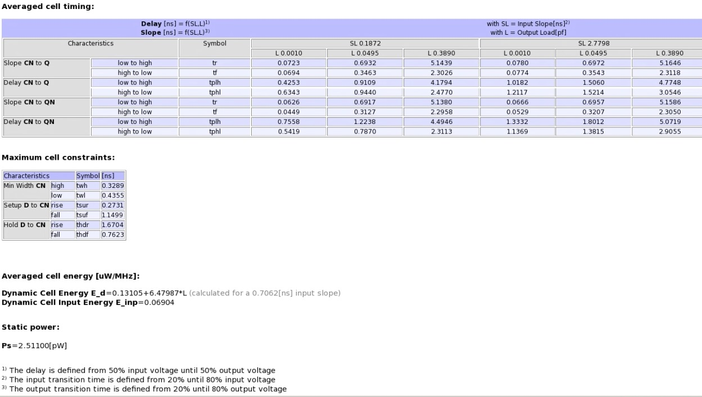
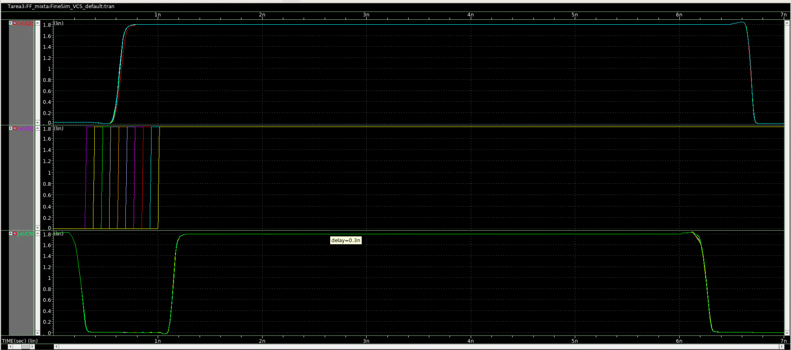

# Tarea3_VLSI

## Estudiantes
- Jesús Rojas Vargas
- Brayan Montenegro Elizondo

## Referencias
[1] N. Weste and D. Harris, CMOS VLSI Design: A Circuits and Systems Perspective, 4 edition. Boston: Addison-Wesley, 2010.

[2] J. Rabaey, A. Chandrakasan y B. Nikolic. Circuitos integrados digitales. Segunda Edición. Prentice Hall. 2005

## Desarrollo

### Caracterización de un Flip Flop Estático (DFFHDLLX0) Amo-Esclavo de 1 bit

En primer lugar, se instanció en Custom Compiler el esquemático y trazado de un flip flop estático Amo-Esclavo de 1 bit. Para su diseño, se utilizó el flip flop disponible en la biblioteca de la herramienta, específicamente en la librería D_CELLS_HDLL, empleando la celda DFFHDLLX0. Este modelo no contaba con reset, teniendo solo las entradas D y CN, y las salidas Q y QN.
Con el próposito de contar con un reloj más realista se implementó una señal de reloj conectándola a un metal adecuado dentro del trazado (MET3), y se manejó mediante dos inversores de tamaño 1x, 4x. El trazado del flip flop se muestra en la siguiente figura:

Con el reloj listo, se implemento el testbench que se muestra en la siguiente figura. Se implementaron un conjunto de simulaciones para obtener los parámetros de $t_{cd}$ y $t_{pcq}$, siguiendo la metodología descrita en el inserto E de [2] y, específicamente, lo expuesto en la sección 10.4.2 de [1]. Se utilizó una carga de FO4 de inversores mínimos en la salida del flip flop. Con esto se determinaron y comprobaron mediante simulación en HSPICE, los parámetros $t_{setup}$ y $t_{hold}$, utilizando la técnica de variación de $t_{cd}$ y midiendo $t_{pcq}$. Estos resultados se compararon con los tiempos $t_{setup}$ y $t_{hold}$ listados para este flip flop a través de la herramienta \textbf{LibertyDisplayer}, para evaluar su precisión. 
El esquemático utilizado para las simulaciones se muestra a continuación:

 Y los datos extraídos de la herramienta para la celda son los siguientes:
 

Una vista general de uno de los conjuntos de simulaciones utilizado para la medición de parámetros se muestra en la siguiente figura:

### Comparación de resultados

