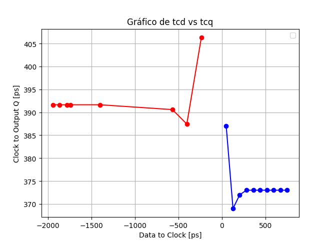

# Tarea3_VLSI

## Estudiantes
- Jesús Rojas Vargas
- Brayan Montenegro Elizondo

## Referencias
[1] N. Weste and D. Harris, CMOS VLSI Design: A Circuits and Systems Perspective, 4 edition. Boston: Addison-Wesley, 2010.

[2] J. Rabaey, A. Chandrakasan y B. Nikolic. Circuitos integrados digitales. Segunda Edición. Prentice Hall. 2005

## Desarrollo

### Caracterización de un Flip Flop Estático (DFFHDLLX0) Amo-Esclavo de 1 bit

En primer lugar, se instanció en Custom Compiler el esquemático y trazado de un flip flop estático Amo-Esclavo de 1 bit. Para su diseño, se utilizó el flip flop disponible en la biblioteca de la herramienta, específicamente en la librería D_CELLS_HDLL, empleando la celda DFFHDLLX0. Este modelo no contaba con reset, teniendo solo las entradas D y CN, y las salidas Q y QN.
Con el próposito de contar con un reloj más realista se implementó una señal de reloj conectándola a un metal adecuado dentro del trazado (MET3), y se manejó mediante dos inversores de tamaño 1x, 4x. El trazado del flip flop se muestra en la siguiente figura:

Con el reloj listo, se implemento el testbench que se muestra en la siguiente figura. Se implementaron un conjunto de simulaciones para obtener los parámetros de $t_{cd}$ y $t_{pcq}$, siguiendo la metodología descrita en el inserto E de [2] y, específicamente, lo expuesto en la sección 10.4.2 de [1]. Se utilizó una carga de FO4 de inversores mínimos en la salida del flip flop. Con esto se determinaron y comprobaron mediante simulación en HSPICE, los parámetros $t_{setup}$ y $t_{hold}$, utilizando la técnica de variación de $t_{cd}$ y midiendo $t_{pcq}$. Estos resultados se compararon con los tiempos $t_{setup}$ y $t_{hold}$ listados para este flip flop a través de la herramienta LibertyDisplayer, para evaluar su precisión. 
El esquemático utilizado para las simulaciones se muestra a continuación:

 Y los datos extraídos de la herramienta para la celda DFFHDLLX0 son los siguientes:
 

Para la toma de datos y parámetros de $t_{cd}$ y $t_{pcq}$, estableciendo una varibale "delay" en la fuente generadora de la señal D, se hizo uso de simulaciones paramétricas, fijando 10 variaciones para diferentes tiempos de "delay", dentro de la simulación, se empleó el uso de la opción "measure tool", la cual permite establecer una relación entre 2 de las opciones de señal disponibles en el conjunto de pruebas, donde se fija la señal de clock (CN) como referencia y la segunda señal se alterna entre D y Q, según el valor de delay deseado.
Una vista general de uno de los conjuntos de simulaciones utilizado para la medición de parámetros se muestra en la siguiente figura:

### Comparación de resultados

Para determinar los tiempos de setup y hold del flip flop implementado, se construyó la gráfica que se muestra a continuación a partir de las mediciones realizadas en el punto anterior. 

El proceso de caracterización consiste en medir el retardo entre las transiciones al 50% de Clk (D) y Q para diferentes valores de entrada y cargas de salida. La caracterización del tiempo de setup y hold es más elaborada. En este caso, se midieron $t_{setup}$ y $t_{hold}$ a partir de la gráfica, como se explica en [2], y se compararon con los valores consultados en la biblioteca de LibertyDisplayer.

En la siguiente tabla se muestra los resultados:

| Parámetro   | LibertyDisplayer    | Flip Flop implementado | 
|-------------|---------------------|------------------------|
| $t_{setup}$ |      1.1499 ns      |  	     1.4 ns          |
| $t_{hold}$  |       762 ps        |        608 ps	         |

